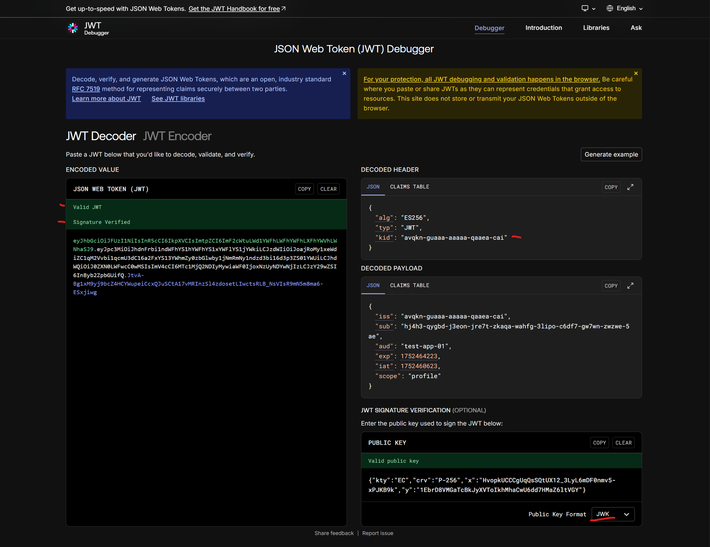

# Prometheus Protocol


## Overview

Prometheus Protocol is a full-featured, on-chain OAuth2 provider built for the Internet Computer. It enables developers to secure their applications using the industry-standard Authorization Code flow, allowing users to log in with their Internet Identity and grant specific permissions to third-party applications.

The system issues signed JSON Web Tokens (JWTs) that can be verified by any resource server in the ecosystem, providing a decentralized and robust foundation for authentication and authorization.

## Current Status: Phase 0 Complete

**Phase 0: Project Chimera** is complete. The core authentication engine is online and fully functional.

**Key Features Implemented:**
- **OAuth2 Authorization Code Flow:** The `/authorize` endpoint correctly validates client requests and initiates the login flow.
- **Internet Identity Integration:** A dedicated frontend canister handles the login process via Internet Identity.
- **Secure Token Issuance:** The `/token` endpoint securely exchanges single-use authorization codes for signed access tokens.
- **Standards-Compliant JWTs:** Generates `ES256` signed JWTs using the web-standard `P-256` curve, ensuring maximum interoperability.
- **Public Key Discovery:** Exposes the public signing key via a standard `/.well-known/jwks.json` endpoint for easy verification by resource servers.

## Architecture

The project consists of two primary canisters:

- **`oauth_backend`:** The main OAuth2 server. It handles all logic for client registration, authorization, token issuance, and key management.
- **`oauth_frontend`:** A simple UI canister that serves the login page. It integrates with `@dfinity/auth-client` to handle the Internet Identity login flow and redirect the user back to the backend to complete the process.

The backend is built using the `ic-server` framework and relies on `mo:ecdsa` for key management and `mo:jwt` for token creation.

## Getting Started

Follow these steps to set up and run the project locally.

### Prerequisites

- [DFINITY Canister SDK (dfx)](https://internetcomputer.org/docs/current/developer-docs/setup/install/)
- [Node.js](https://nodejs.org/) (for frontend dependencies)
- [Mops](https://mops.one/) (for Motoko package management)

### 1. Clone & Install Dependencies

Clone the repository and install all necessary packages.

```bash
git clone <your-repo-url>
cd <your-repo-directory>
npm install
mops install
```

### 2. Start the Local Replica

Start a clean local replica instance.

```bash
dfx start --clean
```

### 3. Deploy the Canisters

Deploy both the backend and frontend canisters to your local replica.

```bash
dfx deploy
```

### 4. Configure the Canisters

The backend needs to know the principal ID of the frontend canister to construct correct redirect URLs. You also need to register a test client application.

**A. Get Canister and Principal IDs:**

```bash
# Get your user principal ID
dfx identity get-principal

# Get the backend canister ID
dfx canister id oauth_backend

# Get the frontend canister ID
dfx canister id oauth_frontend
```

**B. Set the Frontend ID:**
Open `./scripts/set_frontend_canister_id.sh` and replace the canister id with your ID from the previous step.

```bash
./scripts/set_frontend_canister_id.sh
```

**C. Add a Test Client:**
Open ./scripts/add_test_client.sh and replace the principal id with your user principal. This script registers a test app with `client_id="test-app-01"` and `client_secret="supersecret"`.

```bash
./scripts/add_test_client.sh
```

## Running the Full Test Flow

This sequence validates the entire end-to-end process.

### Phase A: Get Authorization Code (Browser)

1.  **Construct the URL:** Copy the URL below and replace `<YOUR_BACKEND_CANISTER_ID>` with your backend canister's ID.

    ```
    http://<YOUR_BACKEND_CANISTER_ID>.localhost:4943/authorize?response_type=code&client_id=test-app-01&redirect_uri=https://jwt.io&state=local-test-12345&scope=profile
    ```

2.  **Authorize:** Paste the URL into your browser. You will be redirected to the login page. Complete the Internet Identity login.

3.  **Capture the Code:** You will be redirected to `https://jwt.io`. The URL will contain the authorization code.
    `https://jwt.io/?code=<A_LONG_HEX_STRING>&state=local-test-12345`

    **Copy the `code` value.**

### Phase B: Exchange Code for Token (Terminal)

1.  **Get Token:** Run the `get_token.sh` script.
    -   Replace `<YOUR_BACKEND_CANISTER_ID>` with your backend canister's ID.
    -   Replace `<THE_CODE_YOU_COPIED>` with the code from the previous step.

    ```bash
    curl -X POST \
      --resolve <YOUR_BACKEND_CANISTER_ID>.localhost:4943:127.0.0.1 \
      http://<YOUR_BACKEND_CANISTER_ID>.localhost:4943/token \
      -H "Content-Type: application/x-www-form-urlencoded" \
      -d "grant_type=authorization_code" \
      -d "code=<THE_CODE_YOU_COPIED>" \
      -d "client_id=test-app-01" \
      -d "client_secret=supersecret"
    ```

2.  **Capture the Token:** The command will return a JSON object.
    `{ "access_token": "ey...", "token_type": "Bearer", ... }`

    **Copy the `access_token` value.**

### Phase C: Verify the Token and Public Key

1.  **Verify the Token:**
    -   Go to [https://jwt.io](https://jwt.io).
    -   Paste the `access_token` into the "Encoded" box on the left.

2.  **Get the Public Key:**
    -   Run the following command in your terminal, replacing `<YOUR_BACKEND_CANISTER_ID>`.

    ```bash
    curl --resolve <YOUR_BACKEND_CANISTER_ID>.localhost:4943:127.0.0.1 http://<YOUR_BACKEND_CANISTER_ID>.localhost:4943/.well-known/jwks.json
    ```
    -   Copy the first key in the JSON output (`{"kty":"EC","crv":"P-256","x":"Hv...","y":"1Eb..."}`).

3.  **Verify the Signature:**
    -   On jwt.io, paste the public key JSON into the "Public Key" box under the "Verify Signature" section.
    -   **Crucially, change the "Public Key Format" dropdown from `PEM` to `JWK`.**

    You should see the green **"Signature Verified"** message. Congratulations!



## License

This project is licensed under the MIT License.
